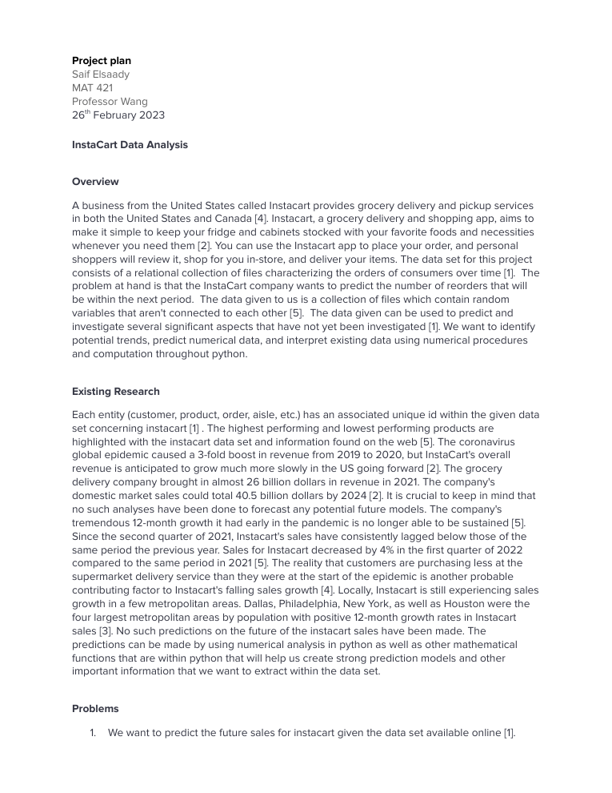

# Applied Numerical Methods — Course Project

> Coursework project from **MAT 421: Applied Computational Methods (2023 Spring)** (2023 Spring C).

**Course:** MAT 421: Applied Computational Methods (2023 Spring) — 2023 Spring C  ·  **Area:** software

## Overview
This repository contains my submitted deliverables for the project below. The course assignment brief (verbatim, abbreviated):

> Your project plan  (about 2 pages with single space ) should include:  1)  Introduction to problems  2)  Models and Numerical Methods 3)  Expectations

## Tools & Tech
- PDF report

## Repository Structure
```
docs/Elsaady_MAT421_PROJECT_1_.html
docs/Elsaady_Projectplan.pdf
images/preview.png
```

## Results
See the report(s)/presentation(s) in `docs/` — e.g. `docs/Elsaady_Projectplan.pdf`.

## Preview


## License
Released under the MIT License — see `LICENSE`.

---
_Part of my engineering coursework portfolio. Deliverables only; routine homework, quizzes, and exams are intentionally excluded._